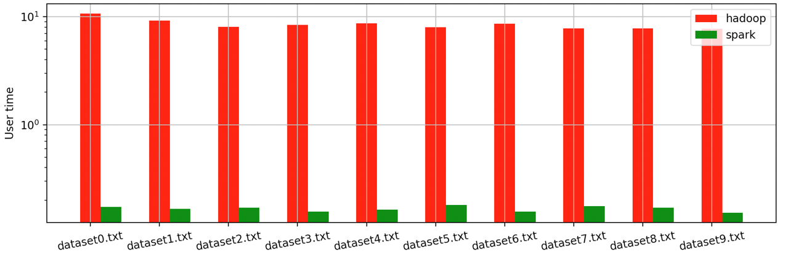
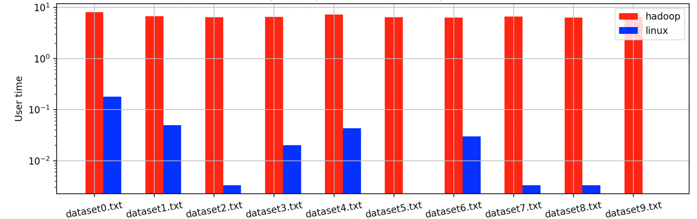

# TP 2 

## Description 

Our code is composed of the following directory :

- `codes` : the main code of our solution. It is composed of : 
  - `bash` : the bash codes to do comparison, count words (with Hadoop, Spark and Linux), and a script to build and run Docker,
  - `friendRecommendation` : the friend Recommendation code in Java for the Hadoop program to do recommendation.
  - `python` : python programs, one to plot the results and the other one to do word count with pyspark.
- 'configs' : the different configuration files. There are the `core-site.xml` and `hdfs-site.xml` used for the pseudo-distributed hadoop mode, and also two bash script for the setup of hadoop and azure.
- `files` : where are the datasets used
- `img` : the folder where are the screenshots of the output we got. 
- `results` : the results of our time comparison. It is composed of `azure` or `local` directories, with the `hadoop`, `linux` or `spark` results depending the scenario. There is also 10 examples of word count outputs for each dataset, such as times for each method on each dataset (3 values). 
- `Dockerfile` : the Dockerfile used to build the docker container.
- `Makefile` : the Makefile used to run commands for a demo. 


## Setup 

First of all, one should change the `RESSOURCE_GROUP` and `NAME` in `configs/setup_vm.sh` to be able to start VM inside the image. 
Make sure to make the key to connect to Azure account the a folder `credentials`, and name it `log_key.cer`. 


To start the docker, use this command :

```
make docker_start
```

It will start the docker 

## Experiments with WordCount program

We set an experimentation to run Hadoop in pseudo-distributed mode. 

To launch the experimentation, use the command : 

```shell
make count_words
```

## Hadoop vs Linux 

To launch the scenario, one should launch the following command : 
```shell
make hadoop_vs_linux
```
Once the script has finished, we can get the results to local in order to plot them.
To do so, use (in local) : 

```shell
make copy_results_to_local
```

Please note that this command can be done after having the results for Hadoop vs spark. 

## Launch the VM

To log to Azure, start the VM, send files to it and connect with SSH inside, use : 

```shell
make azure
```

It will ask to go to a particular URL with a given code. Do so.  
(this part is the only one we were not able to automatize because of this "interactive" step required by Azure)

## Hadoop vs Spark

To run the script to get the results for Hadoop and Spark, use : 
```shell
make hadoop_vs_spark
```

Then, exit the VM with `exit`. 

To get the results into the Docker VM and stop the VM, use : 
```shell
make close_vm
```

Then, use the following command to get back the results on your physical machine (in local) : 

```shell
make copy_results_to_local
```

## Plot results 

To plot the results, we need to have the output of the experimentations, use the following command (in local) : 

```shell
make plot_results
```

It produces the following output : 

| Hadoop vs Linux (local) | Hadoop vs Spark (Azure) 
|---| --- | 
|  |   |
| Time comparison per dataset in local machine | Time comparison per dataset in Azure machine | 

The details values are the following ones : 

- Hadoop vs Linux (local machine) 

| |  hadoop time (s)  |   linux time (s) | 
| --- | --- | --- |  
| dataset0.txt |   8.060000 |  0.180000 | 
|dataset1.txt  | 6.770000 | 0.050000
|dataset2.txt  |6.453333 | 0.003333
|dataset3.txt  |6.506667 | 0.020000
|dataset4.txt  |7.253333 | 0.043333
|dataset5.txt  |6.456667 | 0.000000
|dataset6.txt  |6.396667 | 0.030000
|dataset7.txt  |6.646667 | 0.003333
|dataset8.txt  |6.336667 | 0.003333
|dataset9.txt  |6.560000 | 0.000000
|Mean          | 6.744000 | 0.033333

- Hadoop vs Spark (Azure machine)

| | hadoop |      spark
| --- | --- | --- |
| dataset0.txt | 10.673333 | 0.173333
|dataset1.txt  | 9.216667 | 0.166667
|dataset2.txt  | 8.040000 | 0.170000
|dataset3.txt  | 8.393333 | 0.156667
|dataset4.txt  | 8.683333 | 0.163333
|dataset5.txt  | 7.986667 | 0.180000
|dataset6.txt  | 8.593333 | 0.156667
|dataset7.txt  | 7.786667 | 0.176667
|dataset8.txt  | 7.793333 | 0.170000
|dataset9.txt  | 7.743333 | 0.153333
|Mean         |  8.491000 | 0.166667

## Recommendation 

To launch the command to recommend the users, use the command : 
```shell
make recommendation
```

The outputs of the recommendation for 10 User Ids  are the following : 

| User ID | Recommendation ID | 
| --- | --- |
|924 | 439,2409,6995,11860,15416,43748,45881| 
| 8941 | 8943,8944,8940
| 8942 | 8939,8940,8943,8944
| 9019 | 9022,317,9023
| 9020 | 9021,9016,9017,9022,317,9023
| 9021 | 9020,9016,9017,9022,317,9023
| 9022 | 9019,9020,9021,317,9016,9017,9023
| 9990 | 13134,13478,13877,34299,34485,34642,37941
| 9992 | 9987,9989,35667,9991
| 9993 | 9991,13134,13478,13877,34299,34485,34642,37941


# Authors 


- Baptiste Pauletto (2096684) 
- Clement Bernard (2096223)
- Guilhem Hermet (2097854)
